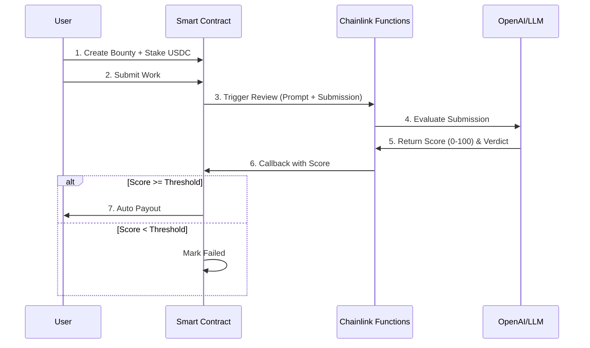

# ModelJudge ⚖️🤖

> **Decentralized Bounty Platform with AI Adjudication**

ModelJudge is a decentralized application (dApp) that revolutionizes task bounties by replacing human arbiters with AI models. It leverages **Smart Contracts** to secure funds and **Chainlink Functions** to connect with LLMs (like OpenAI GPT) for automated, unbiased result verification.


## 🏗 Architecture

The system consists of three main pillars:

1.  **Smart Contract (Solidity)**: Handles staking, bounty creation, and automated payouts.
2.  **AI Judge (Chainlink Functions)**: Off-chain JavaScript environment that acts as a bridge between the blockchain and LLM APIs.
3.  **Frontend (Next.js)**: User interface for creating bounties and submitting work.



## 🛠 Tech Stack

- **Frontend**: Next.js 16 (App Router), TailwindCSS, shadcn/ui
- **Blockchain**: Solidity (v0.8.19+), Foundry (Forge)
- **Oracle**: Chainlink Functions (Serverless off-chain compute)
- **AI**: OpenAI API (GPT-4o-mini / GPT-3.5)

## 📂 Project Structure

```
model-judge/
├── app/                  # Next.js Frontend (Pages & Layouts)
├── components/           # UI Components (shadcn/ui)
├── contracts/            # Foundry Workspace
│   ├── src/              # Solidity Contracts (ModelJudge.sol)
│   ├── functions-source.js # JS script for Chainlink Functions
│   └── script/           # Deployment scripts
└── lib/                  # Shared utilities
```

## 🚀 Getting Started

### Prerequisites

- [Node.js](https://nodejs.org/) (v18+)
- [Foundry](https://getfoundry.sh/) (Forge)
- An OpenAI API Key (for testing the AI judge)

### 1. Smart Contracts Setup

Initialize dependencies and compile contracts:

```bash
cd contracts
forge install
forge build
```

### 2. Frontend Setup

Install dependencies and start the local development server:

```bash
# Return to root directory
npm install
npm run dev
```

Visit `http://localhost:3000` to view the application.

## 📝 Usage Guide

1.  **Create a Bounty**:
    - Define a task (e.g., "Summarize this article").
    - Set a reward amount (in USDC).
    - **Crucial**: Write a clear AI Prompt (e.g., "Score 100 if summary < 100 words and mentions 'DeFi'. Else 0.").
2.  **Submit Work**:
    - Developers submit their text/solution.
3.  **Adjudication**:
    - Chainlink fetches the submission and prompt.
    - The AI evaluates it and returns a score on-chain.
    - If the score passes the threshold, funds are released instantly.

## 🔐 Environment Variables

Create a `.env` file in the root for frontend configuration (if needed) and `contracts/.env` for deployment.

**Contracts (`contracts/.env`)**:

```env
PRIVATE_KEY=your_wallet_private_key
RPC_URL=your_rpc_url
ETHERSCAN_API_KEY=your_etherscan_key
```

## 🤝 Contributing

Contributions are welcome! Please open an issue or submit a pull request.

## 📄 License

This project is licensed under the MIT License.
